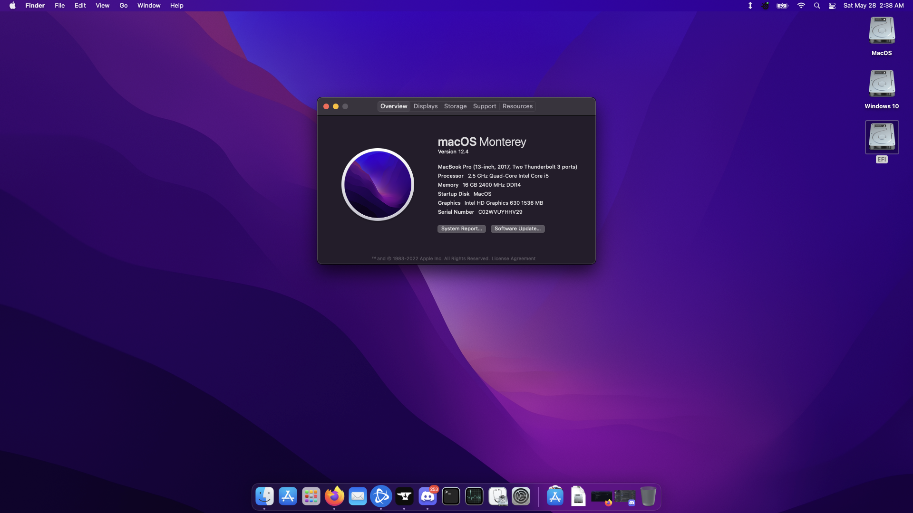

# Dell-Inspiron-7567 Hackintosh (macOS Monterey)
Updated Opencore EFI for Dell Inspiron 7567 Hackintosh. 
Clone tools for combojack if needed. 
This is not a guide.

---

Current OC EFI version: 
- 0.8.0

Current MacOS version:
- Monterey 12.4

Known issues: 

- IGPU only.  1050ti disabled.
- Audio pops during boot. No subwoofer.

---

 

---

